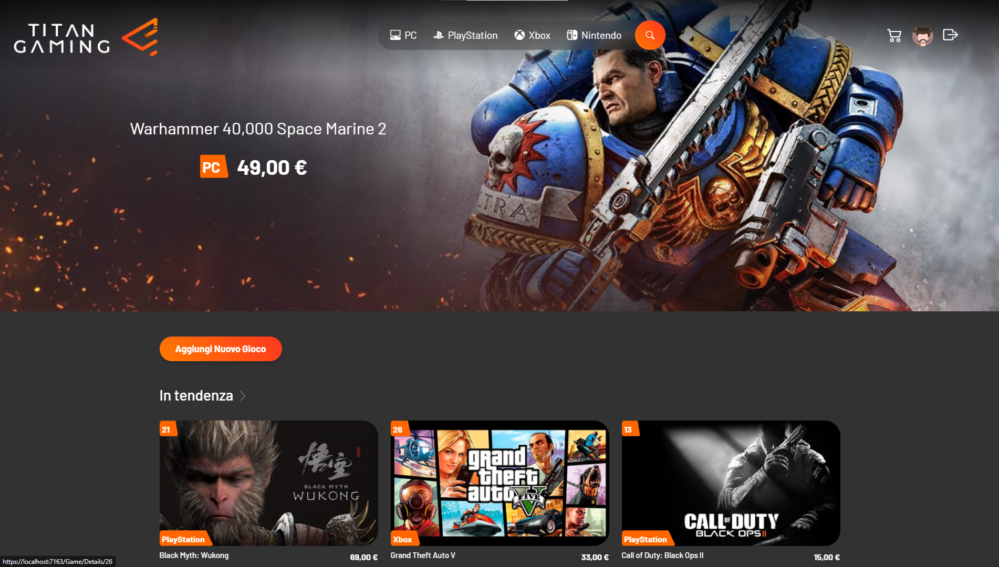
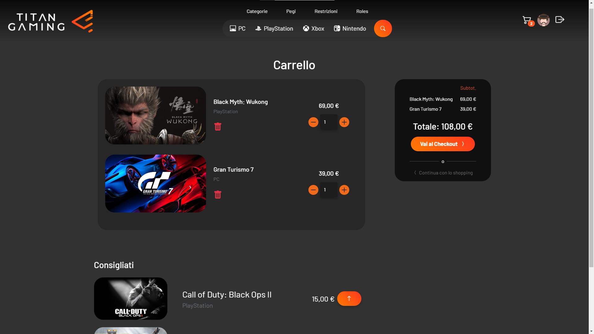
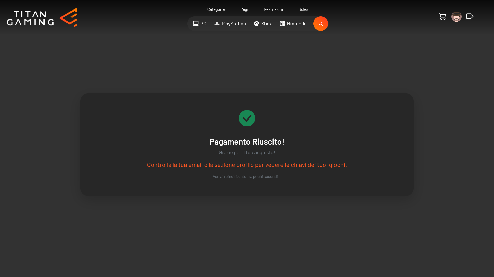
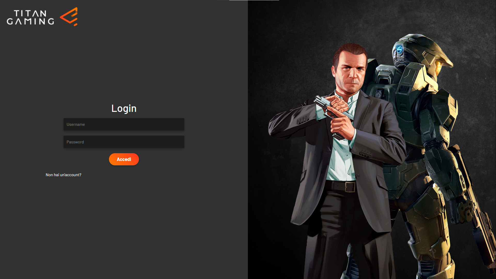
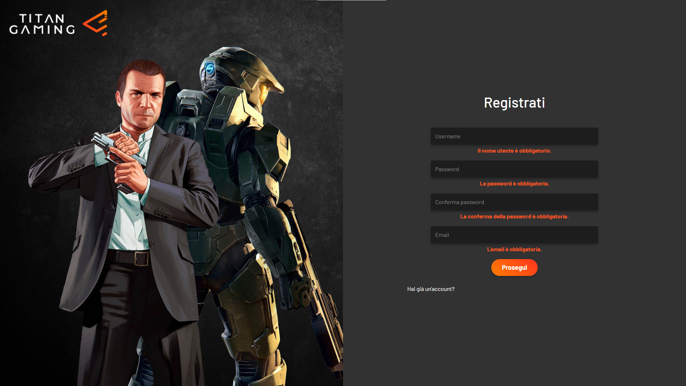
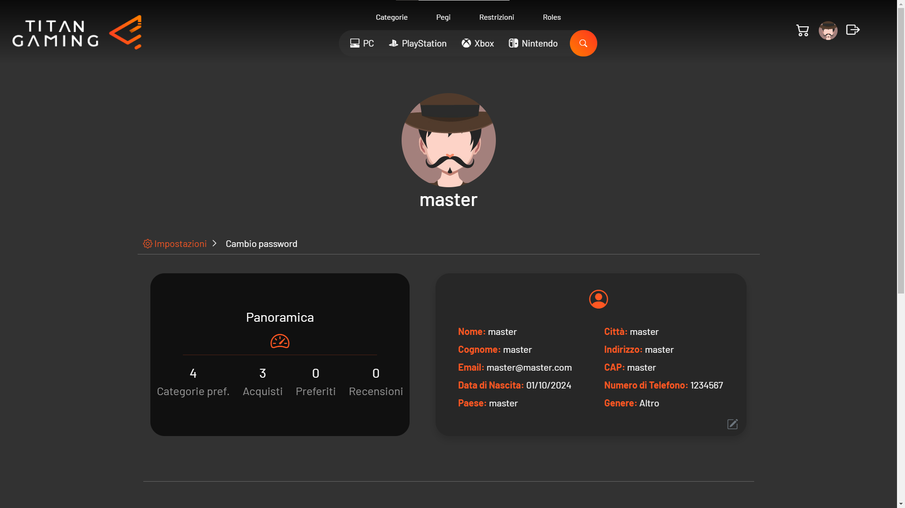

### [🏴 VERSIONE ITALIANA](README.md)
---
# 📖 Project Presentation
The project involves the development of a digital distribution platform for video games, similar to _[Instant Gaming](https://www.instant-gaming.com)_. Users will be able to register, explore a catalog of games, purchase titles, and manage their profile and personal library. The application will feature a user-friendly interface and provide fundamental functionalities for managing accounts, purchases, and reviews.

## 🎯 Project Goal
The project will demonstrate skills in both **frontend** and **backend**, **database management**, and integration of **external APIs**.

## 💻 Technologies Used

### 🖥️ Frontend
- 🎨 _HTML_, _CSS_, _Bootstrap_: To create a modern and responsive user interface (_UI_).
- ✨ _JavaScript_: To manage interactivity and enhance user experience (_UX_).

### ⚙️ Backend
- 🛠 _ASP.NET MVC_: To manage application logic and communication with the database.
- 💻 _C#_: Programming language to develop business logic.
- 📊 _Entity Framework Core_: For data access and interaction with the database.

### 🗄️ [Database](https://github.com/Flavio-Converso/capstone-project/blob/main/assets/screenshots/database-schema.png)
- 💾 _SQL Server_: To manage data related to users, games, purchases, and reviews.
The project will follow the "_Code First_" approach, where classes and application logic are developed first, and the database is automatically generated from the models defined in the code.

### 🔗 API Integrations
- 💳 Payment _APIs_ (_[Stripe](https://stripe.com/)_): To securely handle monetary transactions.

## 🚀 Main Features
- 👤 User registration and login.
- 🕹 Viewing the game catalog with filters and categories.
- 🛒 Cart and purchase management.
- ⭐ Review and rating system.
- 🎟 Management of game licenses after purchase.
- 👤 User profile management: Avatar modification, personal data management, etc.
- 🔧 Administrator dashboard for managing the catalog, users, and all platform-related functionalities.

 

## 📸 Screenshot & Video

https://github.com/user-attachments/assets/405bffb9-cc0d-4791-9493-94f63d3131a1

### 1. Home Page
  

### 2. Cart and Payment Succesful

  
  

### 3. Login and Register

  
  

### 4. User Profile

  

---
