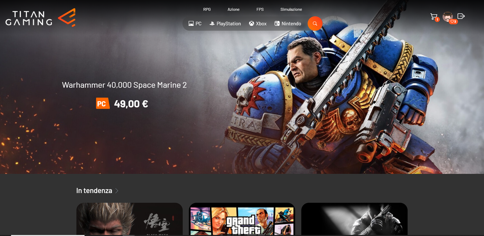
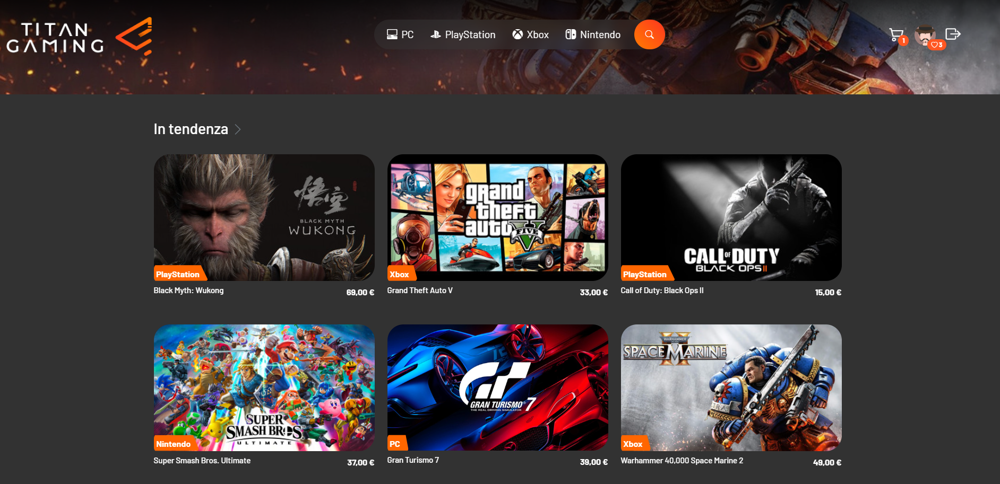
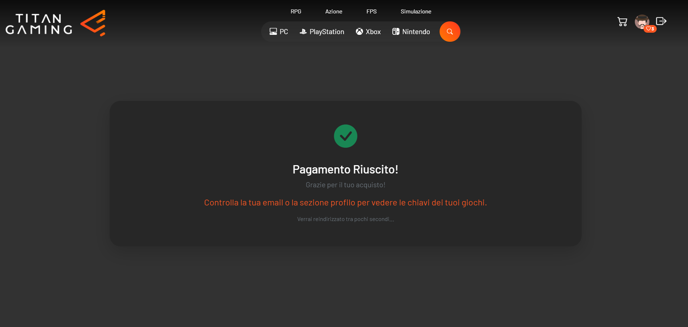
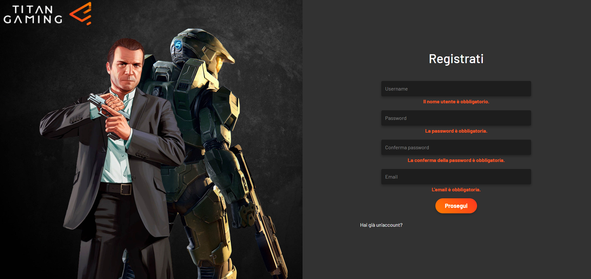

### [🏴 ENGLISH VERSION](README.en.md)
---
# 📖 Presentazione del Progetto
Il progetto prevede lo sviluppo di una piattaforma di distribuzione digitale per videogiochi, simile a _[Instant Gaming](https://www.instant-gaming.com)_ o _[G2A](https://www.g2a.com/)_. Gli utenti potranno registrarsi, esplorare un catalogo di giochi, acquistare titoli e gestire il loro profilo e la loro libreria personale. L'applicazione sarà caratterizzata da un'interfaccia _user-friendly_ e offrirà funzionalità fondamentali per la gestione degli account, degli acquisti e delle recensioni.

## 🎯 Obiettivo del Progetto
Il progetto dimostrerà competenze sia nel **frontend** che nel **backend**, nella **gestione dei database** e nell'integrazione di **API esterne**.

## 💻 Tecnologie Utilizzate

### 🖥️ Frontend
- 🎨 _HTML_, _CSS_, _Bootstrap_: Per creare un'interfaccia utente moderna e responsive (_UI_).
- ✨ _JavaScript_: Per gestire l'interattività e migliorare l'esperienza utente (_UX_).

### ⚙️ Backend
- 🛠 _ASP.NET MVC_: Per gestire la logica applicativa e la comunicazione con il database.
- 💻 _C#_: Linguaggio di programmazione per sviluppare la logica di business.
- 📊 _Entity Framework Core_: Per la gestione dell'accesso ai dati e l'interazione con il database.

### 🗄️ [Database](https://github.com/Flavio-Converso/capstone-project/blob/main/assets/screenshots/database-schema.png)
- 💾 _SQL Server_: Per gestire i dati relativi agli utenti, ai giochi, agli acquisti e alle recensioni.
Il progetto seguirà l'approccio "_Code First_", dove le classi e la logica applicativa vengono sviluppate per prime e il database verrà generato automaticamente a partire dai modelli definiti nel codice.

### 🔗 Integrazioni API
- 💳 _API_ di Pagamento (_[Stripe](https://stripe.com/)_): Per gestire in modo sicuro le transazioni monetarie.

## 🚀 Funzionalità Principali
- 👤 Registrazione e login degli utenti.
- 🕹 Visualizzazione del catalogo giochi con filtri e categorie.
- 🛒 Carrello e gestione degli acquisti.
- ⭐ Sistema di recensioni e valutazioni.
- 🎟 Gestione delle licenze di gioco dopo l'acquisto.
- 👤 Gestione del profilo utente: Modifica dell'avatar, gestione dei dati personali, ecc.
- 🔧 Dashboard amministratore per la gestione del catalogo, degli utenti e di tutte le funzionalità relative alla piattaforma.

 

## 📸 Screenshots

### 1. Home Page e Catalogo Giochi

  
  

### 2. Carrello e Acquisto Completato

  
  

### 3. Login e Registrazione

  
  

### 4. Profilo Utente

  

---
